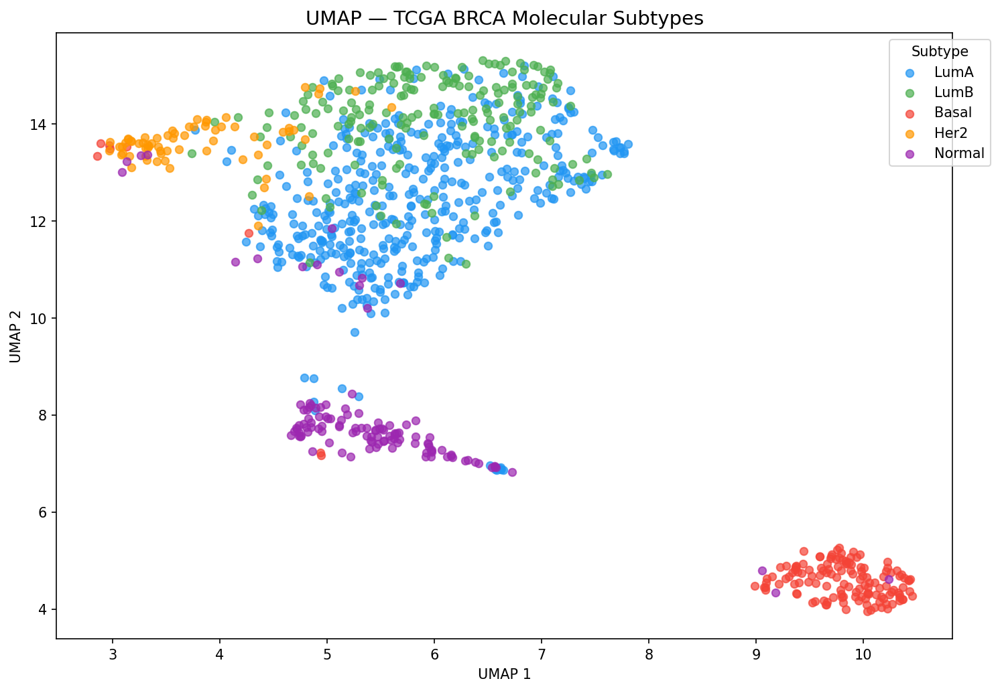
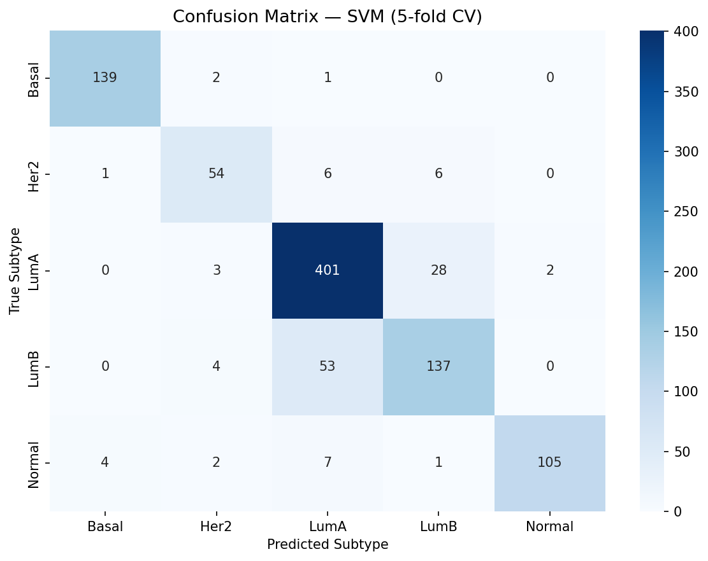

# Cancer Subtype Classifier — TCGA BRCA

> Classifying breast cancer molecular subtypes (Luminal A, Luminal B, 
> HER2-enriched, Basal-like, Normal) from RNA-seq gene expression data.

## Results

| Model | Accuracy | Std |
|-------|----------|-----|
| SVM | 87.45% | ±2.03% |
| Logistic Regression | 86.09% | ±1.36% |
| Random Forest | 85.25% | ±2.89% |

*5-fold stratified cross-validation on 956 TCGA-BRCA samples*

## Visualizations

### UMAP — Molecular Subtype Clustering


### Confusion Matrix — SVM


## Key Findings
- Basal-like subtype is most molecularly distinct — 97.9% recall
- LumA/LumB confusion is expected and biologically meaningful —
  both are luminal subtypes sharing estrogen receptor expression
- Top variable genes (SCGB2A2, TFF1, MUCL1) are known breast 
  tissue and cancer markers, confirming data integrity

## Dataset
- Source: TCGA-BRCA via UCSC Xena
- Samples: 956 tumor samples with PAM50 subtype labels
- Features: 20,530 genes → top 1,000 by variance

## Approach
1. Variance-based feature selection (top 1,000 genes)
2. UMAP for 2D visualization of subtype structure
3. SVM, Random Forest, Logistic Regression classifiers
4. 5-fold stratified cross-validation

## Setup
```bash
conda create -n bioai python=3.11
conda activate bioai
pip install -r requirements.txt
jupyter notebook notebooks/01_eda.ipynb
```

## Project Structure
```
notebooks/  — step by step analysis
results/    — figures and metrics
src/        — reusable modules
data/       — raw and processed data
```
